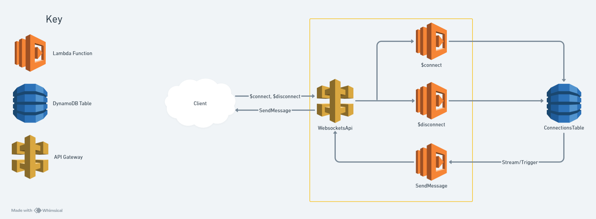

## Serverless Websocket Example
This repository demonstrates how to create a API Gateway Websocket API using the Serverless framework.

It features connect and disconnect endpoints, along with a sendMessage function that sends messages to clients.
The Flow:
1. When a client calls the $connect endpoint a connection is established, and a record is created in the DynamoDB table for that connection.
2. When a record is changed/updated in the table the DynamoDB stream triggers the sendMessage function passing the updated record.
3. The sendMessage function calls the client with the updated record.
4. When the client calls the $disconnect endpoint the connection will be destroyed, and the associated record will be removed from the table.

### How to Use

#### Deploy

This stack uses the Serverless Framework to deploy on AWS.
You can deploy using the following steps:
1. (Optional) Run `nvm use`. For more info on NVM, [see here](https://github.com/nvm-sh/nvm?tab=readme-ov-file#about).
2. Run `npm i` to install required dependencies.
3. (Optional) Adjust `serverless.yml` config as necessary.
4. Run `npm run deploy` to deploy the stack.

Once the stack is deployed, the console output should contain the URL of the API.
#### Use
Once the stack is deployed, you can run a test workflow as follows:
1. Open the exampleFE page in a web browser.
2. Enter the API URL and click connect.
3. The Request ID will be shown at the top of the page. Copy the Request ID and run `npm run be {Request ID}`.
4. The table on the exampleFE page will update as results are streamed through the API.
